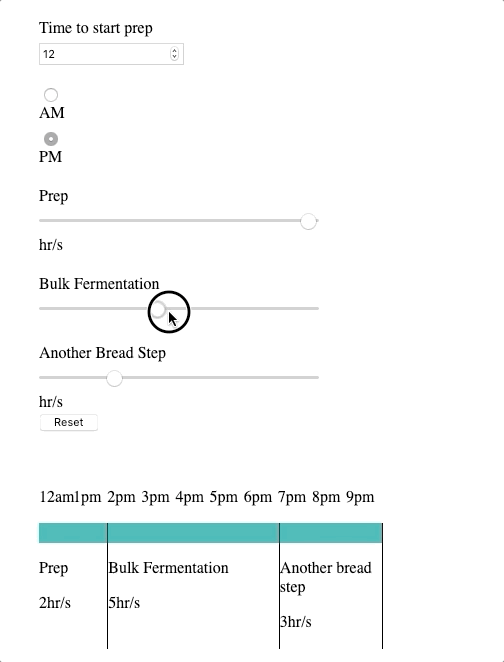

# Bread App Notes

## 4/3

- Currently using a lot of loops and counters to determine am or pm. As I have hard coded the am and pm this is causing an issue when the counter changes.
- I think I need ot change the implementation to 24 hr as that way 12 and 24 are unique identifiers that will not change based on the counter amount.
  

- I have also added the radio buttons but they are not yet hooked up.
